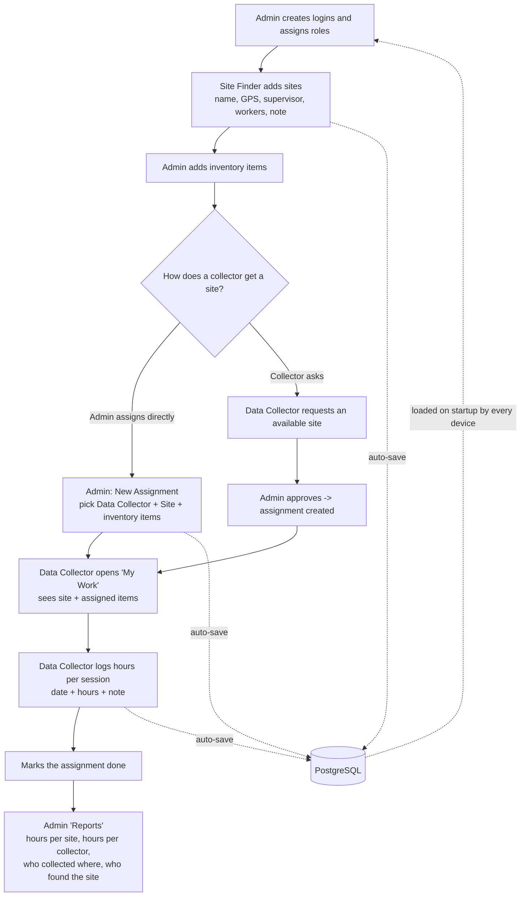

# Site &amp; Inventory Manager

## Repo layout

This is a monorepo with the frontend and backend as separate apps:

```
frontend/   React + Vite SPA (the UI) — deployed to GitHub Pages
backend/    Node + Express + Prisma API, backed by PostgreSQL
backups/    Timestamped full-database JSON snapshots (gitignored)
```

## Run locally

**Prerequisites:** Node.js, PostgreSQL running locally (or point `DATABASE_URL` at
any Postgres instance).

**Backend:**
```
cd backend
cp .env.example .env        # edit DATABASE_URL if needed
npm install
npx prisma migrate dev      # creates the schema
npm run dev                 # http://localhost:4000
```

**Frontend:**
```
cd frontend
npm install
npm run dev                 # http://localhost:3000
```

The frontend talks to `backend/` via `frontend/src/services/apiBridge.ts` —
set `VITE_API_URL` in `frontend/.env` to point it at wherever the backend
is running (defaults to `http://localhost:4000`).

---

## What it is

A small field-operations app. **Site Finders** add field sites, **Data Collectors**
request sites and log how many hours of data they collect, and the **Admin** manages
the inventory, assigns collectors to sites (with inventory items), approves requests,
and reads the reports. Data is stored in a dedicated PostgreSQL database
(see **Repo layout** above).

## Roles

| Role | Can do | Sees |
| --- | --- | --- |
| **Admin** | Manage inventory; assign a data collector to a site and hand them inventory items; approve/reject site requests; manage logins; read all reports. | Everything |
| **Site Finder** | Add / edit field sites (name, GPS with "use current location", supervisor + contact, number of workers, a note). | **Only the sites they added** |
| **Data Collector** | Browse available sites and request the ones they want; on their assignments, log collection hours (date + hours + optional note) and mark the site done. | **Only their own** requests and assignments, plus the public list of available sites |

Everyone signs in with an in-app **Login ID + password** (created by the Admin under
**Logins**). This is not a Google login.

## The tabs

**Admin**
- **Sites** — every site, and which Site Finder added it. Add / edit / delete.
- **Inventory** — simple item list (Item ID, Name, Category, Quantity, Note). Add / edit / delete. Items held by someone show *With \<collector\>*; a returned-with-a-problem item shows *Flagged*.
- **Returns** — items currently held by collectors. **Check in** opens a form ("is everything OK? camera, lens, cables, battery, body") — if not OK you add a note and the item is flagged in the inventory and returned to stock.
- **Assignments** — assign a Data Collector to a Site. The modal shows that collector's fixed equipment kit (read-only). Shows hours logged.
- **Requests** — data collectors' requests for available sites. **Approve** creates the assignment; **Reject** dismisses it.
- **Reports** — the numbers (see below).
- **Logins** — create / edit / suspend / delete user logins and set their role. For a Data Collector there's an **Equipment** button to set the fixed kit they carry to every site.

Equipment model: a Data Collector's kit is **fixed** — set it once under Logins, and they keep those items across every site and project. The items are only freed when an admin **checks them in** on the Returns tab (with the condition check).

A data collector can only have **one open site at a time** — a pending request or an active assignment blocks new requests until that site is marked done.

Site location can be set three ways: **use current location** (on site), **paste a Google Maps link**, or **search a place name**.

**Site Finder**
- **My Sites** — add and manage the sites you found. New sites start as *Available*.

**Data Collector**
- **Available Sites** — every *Available* site, with a **Request** button. Shows your request status.
- **My Work** — your assignments. For each: the site, the inventory items you were given,
  and a form to **log hours** (date + hours + note). Sessions add up into a total. Mark it done when finished.

## Reports (Admin)

- **Totals:** number of Data Collectors, number of Sites, total hours logged, number of Site Finders.
- **Collection log:** one row per assignment — Data Collector · Site · Found by · Hours · Sessions · Status. Filter by collector, by site, or free-text search.
- **Total hours per site** (+ who found it, + which collectors worked it).
- **Total hours per data collector** (+ how many sites).

## How the data is stored (PostgreSQL)

- `backend/` is a Node + Express API, backed by a PostgreSQL database, that the
  frontend talks to over HTTP (`frontend/src/services/apiBridge.ts`).
- The app **loads from the backend on startup** and **writes every change back
  automatically** (~1 s later), and every ~6 s it re-checks the backend so other
  people's changes appear on your screen automatically.
- Data lives in real relational tables (`sites`, `inventory_items`, `assignments`,
  `site_requests`, `users`, plus the inventory/assignment child tables) — see
  `backend/prisma/schema.prisma` for the full shape.
  **Edit data through the app**, or via Prisma Studio (`npm run prisma:studio`
  in `backend/`) for a direct look.

```
 App (any device) ──auto-save on every edit──▶  backend API ──▶  PostgreSQL
        ▲                                                              │
        └───────────────── auto-load on startup / poll ────────────────┘
```

## Typical workflow



Plain-text version:

```
1. Admin           -> create Login IDs + roles (Admin / Site Finder / Data Collector)
2. Site Finder     -> add sites (name, GPS, supervisor, workers, note)  [status: Available]
3. Admin           -> add inventory items (Item ID, Name, ...)
4a. Admin          -> New Assignment: choose Data Collector + Site + inventory items
4b. or Data Collector -> request an Available site  ->  Admin approves  ->  assignment created
5. Data Collector  -> "My Work": see the site + items; log hours (date + hours + note) per session
6. Data Collector  -> mark the assignment Done
7. Admin           -> "Reports": total hours per site / per collector, who collected where,
                      and which Site Finder found each site

Every step auto-saves to PostgreSQL via the backend API; every device loads from it on startup.
```
